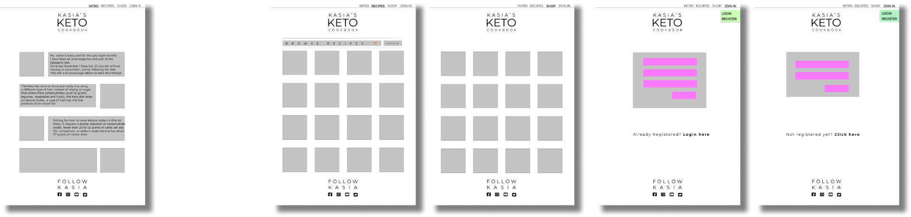
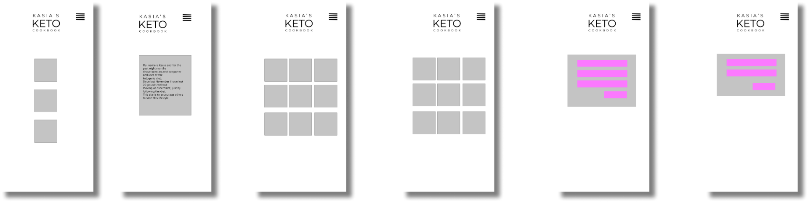

# [Kasia's KETO Cookbook](https://keto-cookbook.herokuapp.com/)

In the ever evolving world of different diets, the Food Pyramid as we know it no longer applies for most people. Many diets would at this stage have eliminated certain contents of the pyramid, in Keto's case that pyramid has been literally turned up-side-down. This website was developed to assist those who are embarking on their lifestyle change as well as those who are looking for some inspiration to their existing journey.

 
## UX
 
The theme of this page is cooking, and there are various types of users this page may appeal to:

*User type 1: Person interested in changing their lifestyle and considering starting KETO*


*User type 2: Those already practicing the KETO lifestyle and diet, but looking for inspiration for daily menus*


*User type 3: Advertisers looking to tap into the wide group of users. As one of the website pages is shop, there is an opportunity of affiliation or paid sponsorship

# User Stories

*Guest User*
- As a guest user of this website I might not want to sign up for anything immediately, I want to browse - I expect this site to have some content available for me
- As a guest user I appreciate that the website is intuitive to navigate, I am visiting it first time
- As a guest user I might not go past the Home page, so I expect some overall information there about the page, to catch my attention
- As a guest user I appreciate the colours should be easy on the eye, with food as a subject matter, I appreciate the colorfullness
- As a guest user, without signing up, I expect some educational value to the website, so the content of Home page is very important to me

*Logged in User*
- As a registered user I appreciate that the page delivers a functionality of providing me with ideas for my daily menu
- As a registered user I can log onto my account and add some recipes I already own or know
- As a registered user I can interact with other members of the site

*Advertiser*
- As an advertiser I appreciate that my products are displayed in a way that would invite a potential customer and make it easy to reach my products
- As an advertiser I expect this page to be easy to navigate, as this will increase chances for the customer to get to my web-shop

*Owner*
- As the owner of the website I want encorage user to register and visit my site as often as possible, so I ensure the content varies and addresses as wide user group as possible


## Wireframes




----------------------------------------------------------------------------------------------------------------------------------------------------------
## Features

In this section, you should go over the different parts of your project, and describe each in a sentence or so.
*Home*
This page will provide some inspiration for the user, be it registered or not registered. The aim is to give as much info about the diet as possible, if follows order of __What, How, Why__. Ideally a potential user will immediately know what this page has to offer and continue on exploring it. Categories are readily available on this page, so the user does not need to go looking for the next step.
*Shop*
This page is created for the potential advertiser or affiliate. The products are presented in a way that makes them linked to the diet, the display follows a suit of __Starter Keto-Kit__ and it will appeal to both registered and unregistered user. The links under the products bring user to the relevant advertiser's ecommerce site, so no need for them to register with the cookbook website.

*Recipes*
This page is visible to both types of user, be it registered or not registered. The aim is just to pass on the information and invite user to explore this diet. A searchbox will return results of a seach 
*Register*
Once decided they want to have access to more information, the unregistered user may register here
*Profile*
After signing up and logging in, user has access to more information and may also add some of his own favourite recipes
 
### Existing Features


### Features Left to Implement


## Technologies Used


## Testing


### Deployment

#### To run the app on Heroku.

Create a Heroku account. 
Click to start a new app. 
Pick your location based on the closest free version (or paid version) to your actual location. 
For this project the location selected was Europe

Once your app has been created, then move to the ‘deploy’ tab. 
Choose connect via Gitpod and find your repository.

Go to Settings tab and click on the Reveal Config Vars button. 
Configure the following:

``` 
IP: 0.0.0.0
PORT: 5000
MONGO_URI: "link to your MongoDB"
MONGODB_NAME: "name of your database"
SECRET_KEY: "your secret key"

```
Go to Deploy tab and Enable Automatic Deployments to Gitpod.

With the Heroku settings in place, you can head back to your IDE. The below will need to be set up:

1.	A ‘Procfile’ which will tell Heroku what kind of application it is and how it should be run.
2.	A ‘requirements.txt’ which will tell Heroku which dependencies it needs to install in order for the app to run. The command for ‘procfile’ is:

```
$ echo web: python run.py > Procfile
```

The command for requirements is:
```
pip3 freeze --local > requirements.txt
```
This needs to me re-run if any other dependencies are added mid-project, otherwise the application might not be deployed to Heroku correctly.
As the repository is now connected to push all changes simultanously to Heroku and Gitpod, you may use the terminal to add, commit and push as usual:

```
git add .
```

```
git commit -m "Connected app to Heroku"
```

```
git push
```


# To run the app locally

To run this project locally, you need an IDE installed on your computer. I used Gitpod

•	This project uses MongoDB as a database, and therefore you will need either a MongoDB Atlas account or have MongoDB running locally on your machine. 
o	To set up MongoDB Atlas please see the documentation MongoDB Atlas
•	PIP – to install packages such as pyMongo
•	Python3 – the project uses Python3 for the backend language – specially Python 3.8
•	Git – for easy version control


# Option 1 is to download a zip file.

# Option 2 is to clone the repository.


## Credits

### Content


### Media


### Acknowledgements

