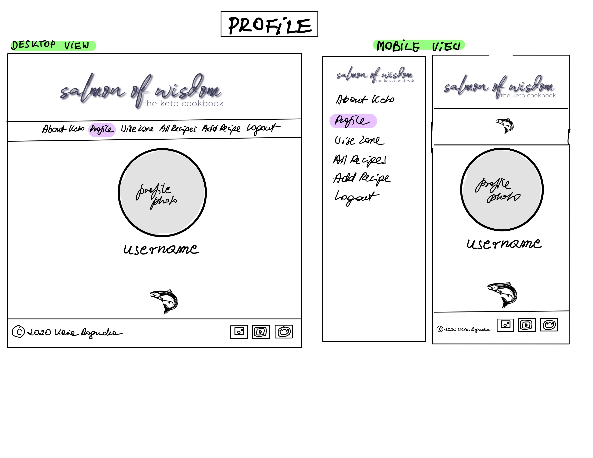

# [Salmon of Wisdom, the keto cookbook](https://keto-cookbook.herokuapp.com/)<hr>

In the ever evolving world of different diets, the Food Pyramid as we know it no longer applies for most people. Many diets would at this stage have eliminated certain contents of the pyramid, in Keto's case that pyramid has been literally turned up-side-down. This website was developed to assist those who are embarking on their lifestyle change as well as those who are looking for some inspiration to their existing journey.

## Table of Contents
* [UX](#ux)
  * [User Stories](#user-stories)
  * [Design](#design)
  * [Wireframes](#wireframes)
* [Features](#features)
  * [Existing Features](#existing-features)
  * [Features Left to Implement](#features-left-to-implement)
* [Technologies Used](#technologies-used)
* [Testing](#testing)
* [Defensive Design](#defensive-design)
* [Deployment](#deployment)
* [Credits and References](#credits)


## UX<hr>
 
The theme of this page is cooking, and there are various types of users this page may appeal to:

*User type 1: Person interested in changing their lifestyle and considering starting KETO*


*User type 2: Those already practicing the KETO lifestyle and diet, but looking for inspiration for daily menus*


### User Stories

<ins> *Guest User* </ins>
- As a guest user of this website I want to just browse - I expect this site to have some content available for me
- As a guest user I want to know what the website is about when I am visiting first time
- As a guest user I want to be able to access, search and share recipes
- As a guest user I want to be able to register and log in easily
- As a guest user I want to be able to check out Social Networks of this website
- As a guest user I want to be able to visit some recommended by this website shops

<ins> *Logged in User* </ins>
- As a registered user I want to be able to get a confirmation every time I log in
- As a registered user I want to be able to add recipes
- As a registered user I want to be able to search recipes
- As a registered user I want to be able to delete recipes I have added
- As a registered user I want to be able to store my information in a dedicated profile
- As a registered user I want to be able to upload my profile picture
- As a registered user I want to be able to be able to share my success within my profile
- As a registered user I want to be able to see other users profiles and check out their achievements
- As a registered user I want to be able to add my own milestones to motivate myself and others
- As a registered user I want to be able to delete my profile when I am no longer interested in being part of this group


### Design
#### :framed_picture: Framework
- Materialize
- jQuery
- Flask
####  :rainbow: Color Scheme
I opted for a very calm, minimalistic color scheme. Various shades of purple and gray, to ensure the page is not too busy
#### :bowtie: Icons
On this project I have used Font Awesome icons. As well as that, I have created icon of my own to illustrate the Instructions (Method) of cooking on both, Add Recipe and Edit Recipe form.
#### :abc: Typography
I designed the main logo using a caligraphy font and some addition of Montserrat. The latter is used througout the website for the headings and other main titles. The text is styled with Poppins font.

## Wireframes<hr>
<details><summary>Base Template</summary>
 

</details>
<br>
<details><summary>Registered User View Template</summary>
 

</details>
<br>
<details><summary>About Keto</summary>
 

</details>
<br>
<details><summary>All Recipes</summary>
 

</details>
<br>
<details><summary>Recipe</summary>
 

</details>
<br>
<details><summary>Register</summary>
  


</details>
<br>
<details><summary>Login</summary>
 

</details>
<br>
<details><summary>Profile</summary>
 

</details>
<br>
<details><summary>Add Recipe</summary>
 

</details>
<br>
<details><summary>Members Zone</summary>
 

</details>


## Features<hr>


### Existing Features 

<ins>Visible to all users</ins>

##### About Keto
This section is introducing the user to what the page is all about, and it's the Keto diet. The About section is answering to the assumption that not everyone visiting this page will know what Keto is, and if they do, they might need more information about it. The About section delivers this information
##### All Recipes
This is the main highlight of the page, it contains the selection of recipes, which combine both recipes added by the users as well as those by the administrators.
###### Recipe
From All Recipes the user will navigate their way to the Recipe by clicking on the "Cook" button.
###### Share Recipe
On the Recipe card there is an option to choose some networks that this recipe can be shared to. There are few defaults like Facebook, Email or WhatsApp but the user can also click on the plus sign to choose other channels.
##### Login
The option to Login is visible to all users, however, only those registered can access it.
##### Register
The option of registering is visible to all users, however, only usernames that do not yet exist in the database can be registered via this route.

<ins>Accessible only by registered user</ins>

##### Profile
This is the page that will welcome a registered user who has just logged onto the site. The layout is very simplistic, a profile photograph with username and the achievement underneath it. This is followed by About section, which allows this registered user tell few words about themselves. 
#### Add Milestone
A diary-like feature, which lets the user to record their progress directly from their profile. These milestones are to motivate them and others that might visit their profile. The milestones are public and visible to all users.
##### Edit Profile
While on the main Wise Zone page, the session user can access profiles of others, plus additional options for their own profile. One of those options is to edit the profile. This gives the session user the opportunity to amend anything in their profile. Since this is a dieting page, the objectives or achievements are subject to amendments.
##### Delete Profile
The other option accessible to the session user is the deletion of the profile. This would be possible once the user decides themselves that they no longer wish to be part of this website. Upon clicking the delete button a modal pops up to inform of the final nature of this action. Once the session user clicks "OK", the profile is removed from database, session cookie removed from the browser and the user is redirected to the Register page.
##### Wise Zone
This page contains a selection of registered users. Anyone can check out their profiles and see what objectives others are headed towards or achievements reached. From here any user can check out others profiles, the session user can access more options related to their own profile, as addressed in detail above.
##### Add Recipe and Edit Recipe (needs to be implemented!)
These are available to the users, for they might want to either add their own favourite creations or note down recipes found in other sources. 
##### Delete Recipe
The third button on the recipe cover card is the Delete button. While the creator of that recipe can freely delete it from the database, the modal will pop up first to ensure the user knows this is final and cannot be reversed.

<ins>Accessible only by Administrator<ins>

##### Manage Categories
At this time there are three main Categories, however, the page assumes that the Administrator might want to expand on it in the future. Therefore there are three options available here:
- Add Category
- Edit Category
- Delete Category


### Features Left to Implement 
Some future features may include:
- Setting the Diary entries to Private
- Functionality to share videos of own cooking tutorials
- Functionality to contact other members


## Technologies Used<hr>

- Gitpod - Used as my primary IDE for coding
- Github - Remote storing of my code online
- Photoshop - to edit the cover photo of the responsive view
- Goodnotes - to create Wireframes
- Procreate - to create the main Salmon of Wisdom logo
- Pixlr.com - used to edit the user images
- Cloudinary - used to store my images

- HTML - base for markup text
- CSS - base for cascading styles
- jQuery - used as the JS functionality
- Materialize - used as the overall design framework

- Flask - used as a microframework
- Jinja - for templating with Flask
- Werkzeug - password hashing, authentication and authorisation

- Heroku - used for app hosting
- Python - back end programming language
- MongoDB Atlas - cloud database
- PyMongo - Python API for MongoDB

-W3C HTML Validator & W3C CSS Validator


## Testing<hr>

<ins>Profile</ins><br>

**Logging in**<br>
- if Registered, click on the Login button on the navbar
- Is the Login form rendered?
- Submit an empty form, does the system come back with an error to fill in the fields?
- Fill in less than five characters and submit, does the system come back with a message to match the requested format?
- Fill in the username and password and submit, does it render the correct profile?
- Are all details provided at Registration displayed?
- Does Milestone dropdown render correctly?

**Registering an Account**<br>
- Click on Register link in the navbar
- Does it render the Registration form?
- Fill out all details
- Click on the Register button
- Does it bring to the Profile page?
- Does the Flash message confirm registration succeeded?
- Are all details entered onto the form render correctly?


**Editing an Account**<br>
- Feature still to be implemented


**Deleting an Account**<br>
- Go to the Wise Zone section, scroll down to the Session User
- Click on the Delete button
- Does the modal pop up to inform of finality of this action?
- Does the flash message pop up to confirm deletion?
- Is the template rendered that for Registering form
- Has the profile been deleted?


<ins>Recipe</ins><br>
**Creating a Recipe**<br>
[**C** in CRUD (Creating)]
- Click on the Add Recipe option in the navbar
- Does the Add Recipe form render?
- Try submitting empty form, does the system come back with an error?
- Fill out all of the required details, click Add Recipe
- Does it render the All Recipes page?
- Does the flash message confirm adding of the recipe?

**Viewing a Recipe**<br>
[**R** in CRUD (Reading/Viewing)]
- Scroll down to where that recipe is and click on Cook
- Does the Recipe page render correctly?
- Does the image uploaded as url render correctly?
- Click on the Share button underneath the Created By, does the modal with social networks pop up?
- Cancel out of the modal, does it work?

**Editing a Recipe**<br>
[**U** in CRUD (Updating)]
- Search for recipe created by Session User
- Click on the Edit button
- Does the Edit Recipe form renders correctly?
- Change anything about the recipe and click on save
- Does the information entered updates correctly on the Recipe card?

**Deleting a Recipe**<br>
[**D** in CRUD (Deleting)]
- Scroll down to the recipe created by the Session User
- Click on the Delete button
- Does the modal pop up to inform of the finality of this action?
- Click on Cancel, does the modal cancel the action?
- Go back to modal and click on delete, does it delete the recipe?

## Defensive Design<hr>

- **Wrong password entered when logging in** returns flash "Incorrect Username and/or Password" to ensure that the non-registered user does not guess one or the other if the incorrect entry is provided.<br>

- **Duplicate username registration attempt** returns flash "Username already exists<br>

- **Wrong username entered when logging in** returns flash "Incorrect Username and/or Password" to ensure that the non-registered user does not guess one or the other if the incorrect entry is provided.<br><br>


**Attempt to access "/add_category" by non Administrator** <br>
link for testing: ***http://keto-cookbook.herokuapp.com/add_category***<br> 
:heavy_check_mark: renders About page if user in session but user is not "Administrator"
:heavy_check_mark: renders Login page if user is not in session<br><br>

**Attempt to access "/get_categories" by non Administrator** <br>
link for testing: ***http://keto-cookbook.herokuapp.com/get_categories***<br>
:heavy_check_mark: renders About page if user in session but user is not "Administrator"
:heavy_check_mark: renders Login page if user is not in session<br><br>

**Attempt to access "/edit_category/category_id" by non Administrator**<br>
link for testing: ***http://keto-cookbook.herokuapp.com/edit_category/5f6a00eadda48a7a60562ada (category_id as example)***<br>
:heavy_check_mark: renders About page if user in session but user is not "Administrator"
:heavy_check_mark: renders Login page if user is not in session<br><br>

**Attempt to access "/delete_category/category_id" by non Administrator**<br>
link for testing: ***http://keto-cookbook.herokuapp.com/delete_category/5f6a00eadda48a7a60562ada (category_id as example)***<br>
:heavy_check_mark: renders About page if user in session but user is not "Administrator"
:heavy_check_mark: renders Login page if user is not in session<br><br>

**As non-logged on user attempt to access "/edit_profile/username"** <br>
link for testing: ***http://keto-cookbook.herokuapp.com/edit_profile/marie***<br>
:heavy_check_mark: renders Login page if user is not in session<br><br>
**As non-logged on user attempt to access "/profile/username"** Login<br>
link for testing: ***http://keto-cookbook.herokuapp.com/profile/marie***<br>
:heavy_check_mark: renders Login page if user is not in session<br><br>
**As non-logged on user attempt to access "/wisemen"** Login<br>
link for testing: ***http://keto-cookbook.herokuapp.com/wisemen***<br>
:heavy_check_mark: renders Login page if user is not in session<br><br>
**As non-logged on user attempt to access "/add_recipe"**<br>
link for testing: ***http://keto-cookbook.herokuapp.com/add_recipe***<br>
:heavy_check_mark: renders Login page if user is not in session<br><br>
**As non-logged on user attempt to access "/edit_recipe"**<br>
link for testing: ***http://keto-cookbook.herokuapp.com/edit_recipe/5f844c38884d26d0d8bd3aac%29***<br>
:heavy_check_mark:renders Login page if user is not in session<br><br>


### *Guest User*
#### As a guest user of this website I want to just browse - I expect this site to have some content available for me
- User that is not logged on nor registered, upon accessing the page for the first or each consecutive time, will first and foremost see the About site. On that site user will  access the opportunity of gaining more information about what the page is about and what the Keto lifestyle is.
#### As a guest user I want to know what the website is about when I am visiting first time
- The About page is what user will see first and therefore they will know whether this site is of their interest or not
#### As a guest user I want to be able to access, search and share recipes
- The All Recipes page is visible to all users, be it registered or not. Once on that page, they can take advantage of viewing and sharing the recipes.
#### As a guest user I want to be able to register and log in easily
- Once user decides they want a full access to the website, they can easily navigate to the Register button from the Navbar
#### As a guest user I want to be able to check out Social Networks of this website
- The footer contains all links to the Social Media

### *Logged in User*
#### As a registered user I want to be able to get a confirmation every time I log in
- A flash message always pops up to confirm the user has successfully logged in
#### As a registered user I want to be able to add recipes
- The option of Adding a new Recipe is easily accessible from the Navbar
#### As a registered user I want to be able to search recipes
- The searchbar is available on top of the All Recipes page, for the ease of search, keywords are included within each recipe, to ensure the user gets as many results to their search as possible
#### As a registered user I want to be able to delete recipes I have added
- The button enabling session user the deleting of their recipe is only visible to the user that created the recipe. This gives user the freedom of removing recipes they no longer wish to have publicised
#### As a registered user I want to be able to store my information in a dedicated profile
- Once User registers/logs in, they are being redirected to their own Profile page, which can be customised
#### As a registered user I want to be able to upload my profile picture
- One of methods of customisation is that the user can have their profile photo displayed on their profile as well as on the Members Zone page. 
#### As a registered user I want to be able to be able to share my success within my profile
- A feature of Adding Milestones enables user to share their little and big successes. These are public, so can serve as a motivating factor to other users, that visit profiles or one another
#### As a registered user I want to be able to see other users profiles and check out their achievements
- From Wise Zone the session user may check out the profiles of other users. This can server as source of inspiration or motivation
#### As a registered user I want to be able to delete my profile when I am no longer interested in being part of this group
- From Wise Zone the session user may choose to delete their own profile. The action of profile deletion is preceded by a modal which ensures that the user realises the finality of that action.


## Deployment<hr>
***Requirements:***
- Python3 to run your application
- PIP to install all app requirements
- IDE of your choice - I used Gitpod
- A MongoDB Atlas account for database development


#### Local Deployment
- Navigate to the Salmon of Wisdom repository: https://github.com/bezebee/kasias-KETO-cookbook
- Click on the green "Code" button
- Copy the link: https://github.com/bezebee/kasias-KETO-cookbook.git
- Using your terminal, type "git clone" followed by that link
- Operate within a virtual environment as widely recommended. The instructions will vary depending on your operating system, so refer to Python Documentation: https://docs.python.org/3/library/venv.html

- Create a file called ".flaskenv" and add the following:
```
 FLASK_APP=run.py
 FLASK_ENV=development
 ```
- Install the required modules with the command `pip -r requirements.txt`
- Set up a free account on MongoDB and create a new Database called **keto_cookbook**
- The following are the collections in that Database:
***categories***
```
_id:<ObjectId>
category_name:<string>
```
***milestones***
```
_id:<ObjectId>
milestone_name:<string>
milestone_date:<string>
milestone_description:<string>
created_by:<string>
```
***recipes***
```
_id:<ObjectId>
category_name:<string>
recipe_name:<string>
recipe_image:<string>
ingredients_list:<string>
method:<string>
preparation_time:<string>
difficulty:<string>
created_by:<string>
keywords:<string>
```
***users***
```
username:<string>
password:<string>
on_keto_since:<string>
personal_success:<string>
username_image:<string>
about:<string>
```
- You should now be able to run this application locally by typing `flask run`
- The website will be available at `http://127.0.0.1:5000`

#### Heroku
- Create a requirements.txt file by typing `pip3 freeze --local > requirements.txt` into the terminal line
- Create a Procfile by typing `echo web: python app.py > Procfile`.
- Add, commit and push these changes to Github
- Navigate to the Heroku website
- Create new app and give it a unique name
- Choose region that is closest to you
- Go to the Deploy tab and choose Github
- Seach for the correct repository and connect
- Go to Heroku Settings and navigate to Config Vars
- Set the following:<br>
```
IP = 0.0.0.0 <br>
MONGO_DBNAME = [Name of MongoDB chosen] <br>
MONGO_URI = mongodb+srv://:@<cluster_name>-qtxun.mongodb.net/<database_name>?retryWrites=true&w=majority <br>
PORT = 5000 <br>
SECRET_KEY = [Secret key chosen]
```
<br>
- Go to the Deploy tab and Deploy Branch, ensuring that master branch is selected


## Credits<hr>

#### Content
https://www.dietdoctor.com/ - All Images and all recipes, as well as some of the images on the About page<br>
https://www.pexels.com/ - Profile photos and some images on the About page

#### Acknowledgements
- Tim Nelson - for helpful and timely guidance, thanks to Tim I learned a great deal about good fundamentals of templating. I will be exploring the Python and Flask path, among others, but this one will be with greatest enthusiasm. I am so grateful.
- Precious Ijege - for mentorship and honest critique
#### Reference
- The Task Manager Miniproject by Coding Institute used as an excellent source of information on environment, database and templating

